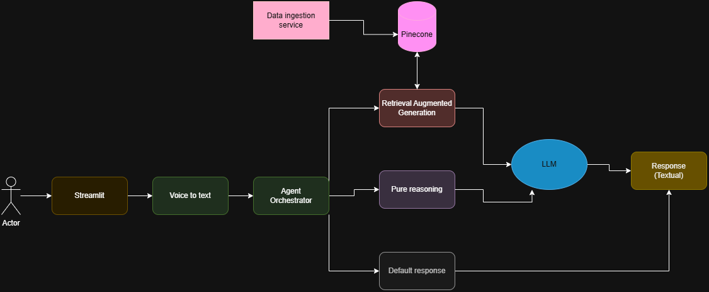
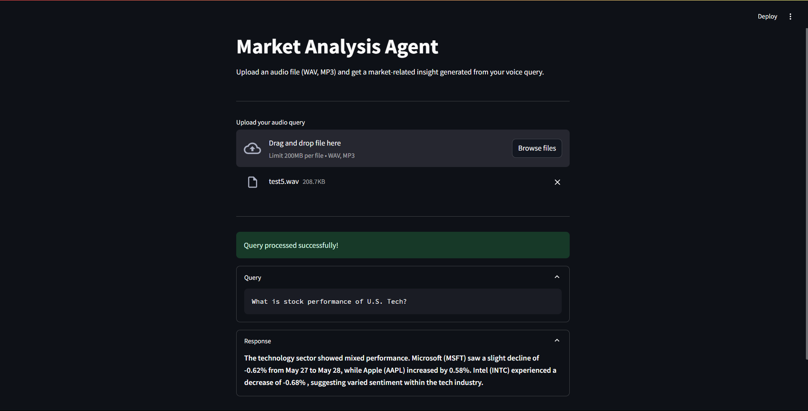
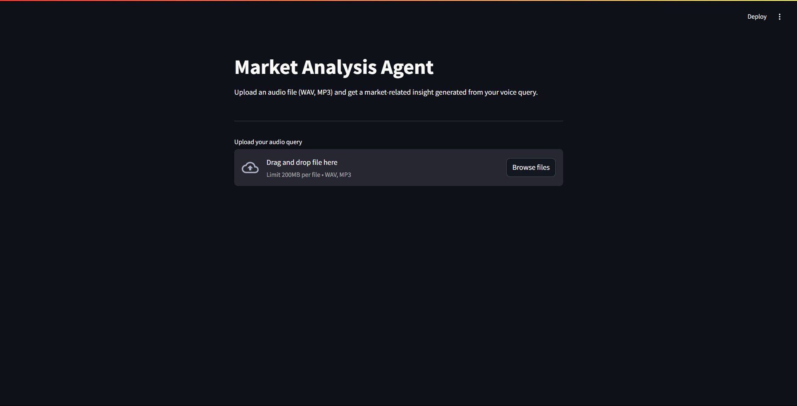

# 🧠 Market Analysis Voice Agent

A voice-activated AI agent that processes market-related queries using audio input. Built with FastAPI, Streamlit, Gemini API, and vector search for contextual understanding.


## 📐 Architecture Overview



## ⚙️ Setup Instructions


```bash
git clone https://github.com/your-username/market-voice-agent.git
cd market-voice-agent
pip install -r requirements.txt
```

### 🔑 Environment Variables

Create a `.env` file in the root directory and add the following variables:

```bash
GEMINI_API_KEY=your-gemini-api-key
PINECONE_API_KEY=your-pinecone-api-key
```

### 🚀 Running the backend

To run the application, execute the following command:

```bash
uvicorn main:app --reload

```

This will start the FastAPI server on port 8000.

### 🚀 Running the frontend
To run the frontend, execute the following command:

```bash
cd streamlit_app
streamlit run app.py
```

This will start the Streamlit app on port 8080.

## Screenshots



## Demo Video

